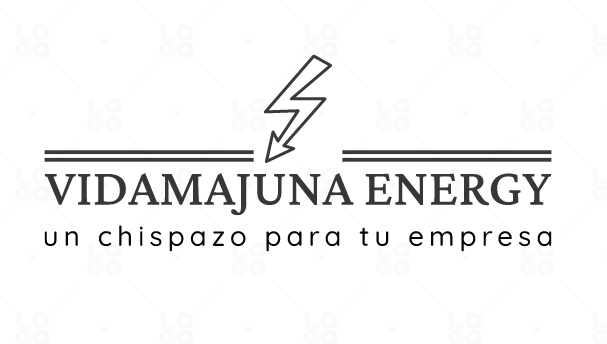
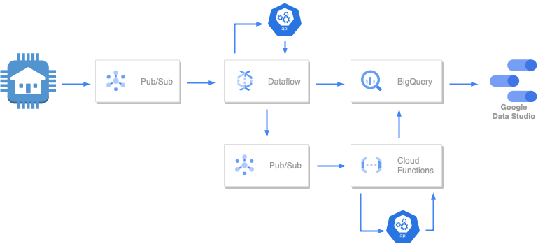
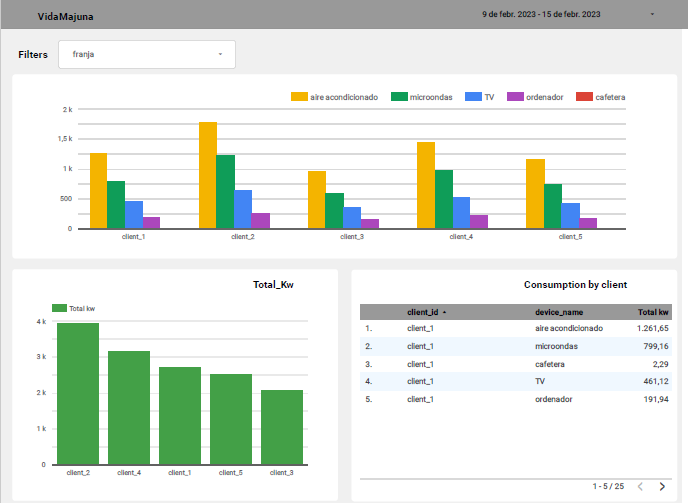

# VIDAMAJUNA



# Data Project 2
## Máster en Data Analytics - EDEM
### Curso 2022/2023

- [Victor Ruiz](https://www.linkedin.com/in/vruizext/)
- [Darío Fernández](https://www.linkedin.com/in/dar%C3%ADo-fern%C3%A1ndez-fern%C3%A1ndez/)
- [Marina Pérez](https://www.linkedin.com/in/marinaperezbarber/)
- [Julio Sahuquillo](https://www.linkedin.com/in/juliosahuquillohuerta/)
- [Nacho Pascual](https://www.linkedin.com/in/nacho-pascual/)

# Proyecto
## Contexto
EDEM ha creado el día 18 de febrero un evento de lanzamiento de empresas con productos IoT. Es vuestro momento! 
En este evento podréis presentar vuestro producto IoT como SaaS. Durante estas tres semanas, debéis pensar un producto IoT, 
desarrollarlo y simular su uso. Este proyecto debe tener una arquitectura escalable pero no es obligatorio cloud, vosotros decidís. 
De cara a participar en este evento, vuestra solución debe ser escalable, opensource y cloud.

## ¿Qué es VIDAMAJUNA?

**VIDAMAJUNA** es una startup tecnológica centrada en la reducción de costes en la factura de la luz de pequeñas y medianas empresas.
 

# Tecnología
## Arquitectura




## Configuración del sistema

## **PubSub**
En primer lugar, vamos a la [página](https://console.cloud.google.com/cloudpubsub) PubSub de Cloud Console y creamos 
dos topics con sus respectivas suscripciones por defecto. 

-El topic **consumption** que utilizaremos para leer los datos de nuestros generadores que simulan los datos de clientes.

-El topic **alertas** en el que se volcará el output del dataflow que luego utilizaremos para las alertas.

 ## **Cloud Storage**

Después, vamos a la [página](https://console.cloud.google.com/storage) de Cloud Storage y creamos un **bucket** único 
que luego utilizaremos para construir el Dataflow Flex Template.

 ## **BigQuery**

En [BigQuery](https://console.cloud.google.com/bigquery) creamos dos tablas para almacenar los datos que ingestamos de los 
dispostivos. Para ello hemos creado un dataset llamado `vidamajuna` donde se encuentra las tablas `consumption` y `alertas`.

1. `consumption` alamacemará los datos del consumo de nuestros clientes.

2. En `alertas` recogeremos la salida de nuestra función que nos indica que si el consumo es adecuado para el período.


## **API**

1. Construir la imagen

```shell
docker build .  -t api_server:latest
```

2. Para testear, ejecutamos la imagen en local 

```shell
docker run  -e PORT=8080  -p '8080:8080' api_server:latest 
```

3. Comprobar que el servidor funciona, http://localhost:8080/status

### Para hacer deploy en Google Cloud Run

1. Habilitar: https://console.cloud.google.com/apis/library/run.googleapis.com

2. Habilitar Container Registry API: https://console.cloud.google.com/marketplace/product/google/containerregistry.googleapis.com

3. Hacer push de la imagen 
```shell
docker push gcr.io/psyched-freedom-376515/api-server:latest
```
4. Deploy en Google Cloud Run
```shell
gcloud run deploy api-server --image gcr.io/psyched-freedom-376515/api-server:latest
```

5. Para parar el servicio hay que destruir la imagen
```shell
gcloud run services delete api-server --region=eu-west1
```

### Para hacer deploy usando Google Actions

Ir a Google [Actions](https://github.com/vruizext/DataProject_2/actions) en el repositorio, hacemos click en la acción 
"Build, Check and Deploy API server on Google Cloud Run", y hacer click en "Run Workflow".

Para parar el servicio, ejecutamos la acción "Destroy GCP resources".

## Cloud Functions

Usando Google Cloud [Functions](https://console.cloud.google.com/functions/list) creamos una función llamada `alerta` que será 
disparada por los datos del tópico `alerta`, donde el Dataflow publicará datos del consumo agregado por cliente. 

Una vez llegan los datos, se les añade la franja de consumo mediante una consulta a la API 
y se ejecuta la lógica pertinente para determinar si el consumo es el apropiado para el período y se genera un registro
en BigQuery en la tabla `alertas` con la notificación. 


## DataFlow

La primera ruta, se encarga de coger los datos de nuestra cola de mensajes , añadirles la franja horaria y guardar los datos en la tabla de consumption.

La segunda ruta,se encarga de coger los datos de nuestra cola de mensajes y realizarles la transformación pertinente para 
agregarlos por cliente y dispositivo, por último guarda el mensaje en el topic alerta para posteriormente utilizarlo en la función.


Para ejecutar el Dataflow usamos una [template](https://cloud.google.com/dataflow/docs/guides/templates/using-flex-templates).

1. Primero tenemos que empaquetar el código en una imagen Docker y subirla al registro de Google Cloud. Para ello, en una terminal, vamos a la carpeta `02_Dataflow` y ejecutamos el siguiente comando.
```shell
gcloud builds submit --tag 'gcr.io/psyched-freedom-376515/dataflow_templates/vidamajuna:latest' .
```

2. En segundo lugar, construimos la template a partir de la imagen de docker que hemos generado.
```shell
gcloud dataflow flex-template build "gs://prueba1feb/dataflow_templates/dataflow_v1.json" \
  --image "gcr.io/psyched-freedom-376515/dataflow_templates/vidamajuna:latest" \
  --sdk-language "PYTHON"
```

3. Y por último, ejecutamos Dataflow usando la template.
```shell
gcloud dataflow flex-template run "vidamajuna-dataflow-job" \
--region europe-west1 \
--template-file-gcs-location "gs://prueba1feb/dataflow_templates/dataflow_v1.json" \
--region "europe-west1" \
--parameters project_id=psyched-freedom-376515 \
--parameters input_subscription=consumption-sub \
--parameters output_topic=alerta \
--parameters output_bigquery=vidamajuna.consumption \
--parameters  api_url=https://vidamajuna-api-ew6hdfei4a-ew.a.run.app/franjas
``` 


## Generador de datos

1. Para iniciar el generador, primero, en una terminal, vamos a la carpeta `01_Generador` y construimos la imagen de docker
```shell
docker build . generador:latest 
```

2. Después de construir la imagen, para iniciar el servidor, primero tenemos que crear una service account con permisos para
escribir en PubSub y descargar las credenciales en formato JSON, en una carpeta fuera del repositorio. Para pasar las credenciales
al contenedor, cargamos el contenido del fichero JSON en una variable de entorno que pasaremos al contenedor. 

```shell
CREDENTIALS_JSON=$(<PATH_TO_CREDENTIALS_JSON)
docker run -e PROJECT_ID=psyched-freedom-376515 -e TOPIC_NAME=consumption -e CREDENTIALS_JSON=$CREDENTIALS_JSON -e CLIENT_ID=1 generador:latest
```

Si ahora queremos iniciar más generadores para simular diferentes clientes, ejecutamos el mismo comando, pero con diferente client ID:
```shell
docker run -e PROJECT_ID=psyched-freedom-376515 -e TOPIC_NAME=consumption -e CREDENTIALS_JSON=$CREDENTIALS_JSON -e CLIENT_ID=2 generador:latest
```


 ## **Data Studio**

Finalmente, desde Data Studio se leen directamente los datos de BigQuery y se muestran en un dashboard interactivo.




 ## **Video del funcionamiento**
 
 https://youtu.be/ryDZf7PGPso
